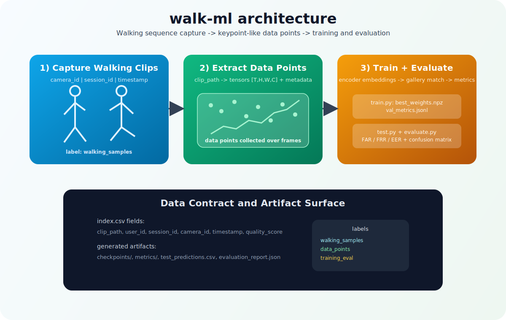

# Architecture



## Overview

This project follows a simple gait-recognition pipeline:

1. Capture walking clips from camera sessions.
2. Convert clips to normalized frame tensors.
3. Build train/val/test splits by session.
4. Train an MLX encoder + classifier.
5. Match probe embeddings to gallery centroids.
6. Calibrate threshold and report FAR/FRR/EER.

## Data Collected Per Clip

- `clip_path`: file location (`.npy` or `.npz`)
- `user_id`: identity label
- `session_id`: split key for train/val/test
- `camera_id`: optional camera source
- `timestamp`: optional capture time
- `quality_score`: optional quality filter

## Runtime Flow

```text
Camera clips -> index.csv -> Dataset loader -> Split builder
    -> Train (MLX) -> Checkpoints + metrics
    -> Test (gallery vs probe) -> predictions
    -> Evaluate (threshold calibration + reports)
```

## Outputs

- `artifacts/<run>/checkpoints/`: best and last model weights
- `artifacts/<run>/metrics/`: train/validation metrics and calibration scores
- `artifacts/<run>/test/...`: predictions, embeddings, and test metrics
- `.../evaluation/`: report JSON, confusion matrix, and model card

