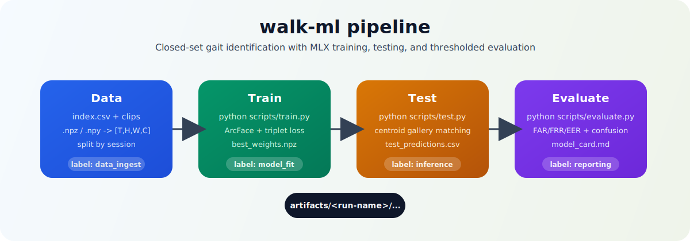

# walk-ml

[](https://www.python.org/)
[](https://github.com/ml-explore/mlx)
[](https://developer.apple.com/metal/mlx/)
[](#)



MLX-first gait identification pipeline for closed-set person recognition.

`Labels:` `computer-vision` `gait-recognition` `closed-set-identification` `threshold-calibration`

## Highlights
- End-to-end train -> test -> evaluate flow from simple CSV indexing.
- Closed-set identification with centroid gallery matching.
- Automatic threshold calibration with FAR target support.
- Built-in artifact logging: checkpoints, metrics, prediction CSVs, and model-card snapshot.

## Project Structure
```text
walk-ml/
  configs/              # Base and training YAML config
  scripts/              # CLI entry points (train/test/evaluate)
  src/data/             # Index loading, clip preprocessing, split logic
  src/models/           # MLX gait encoder and checkpoint helpers
  src/engine/           # Train/test loops
  src/eval/             # Metrics, calibration, confusion reporting
  artifacts/            # Generated runs (checkpoints + metrics + tests)
```

## Requirements
- Python 3.10+
- `pip`
- Apple Silicon Mac recommended for MLX training/inference

Install dependencies:
```bash
python -m venv .venv
source .venv/bin/activate
pip install -r requirements.txt
```

## Data Format
Create `index.csv` inside your dataset root (or point to it via config):

| Column | Required | Description |
| --- | --- | --- |
| `clip_path` | yes | Relative or absolute path to `.npz` / `.npy` clip |
| `user_id` | yes | Person identity label |
| `session_id` | yes | Capture session split key |
| `camera_id` | no | Camera/source tag |
| `timestamp` | no | Capture time label |
| `quality_score` | no | Float used by `min_quality` filtering |

Supported clip formats:
- `.npz` with key `frames` (or first available array key)
- `.npy`

Expected shape:
- `[T, H, W, C]` for color clips
- `[T, H, W]` for grayscale (automatically expanded to 3 channels)

## Configure
Default training config: `configs/train_mlx.yaml` (extends `configs/base.yaml`).

Important config knobs:
- split sessions: `train_sessions`, `val_from_sessions`, `test_sessions`
- temporal + spatial preprocessing: `seq_len`, `image_size`
- optimizer/training: `epochs`, `learning_rate`, `weight_decay`, `warmup_epochs`
- evaluation: `top_k`, `target_far`

## Train
```bash
python scripts/train.py \
  --config configs/train_mlx.yaml \
  --data-root /path/to/data \
  --run-name gait-v1
```

Optional:
- `--resume artifacts/<run>/checkpoints/last_weights.npz`
- `--seed 123`

## Test
```bash
python scripts/test.py \
  --config configs/train_mlx.yaml \
  --data-root /path/to/data \
  --checkpoint artifacts/gait-v1/checkpoints/best_weights.npz \
  --split test \
  --threshold auto
```

Useful options:
- `--split train|val|test`
- `--batch-size 32`
- `--threshold 0.42` (manual override instead of auto calibration)

## Evaluate
```bash
python scripts/evaluate.py \
  --predictions artifacts/gait-v1/test/test-<timestamp>/test_predictions.csv \
  --embeddings artifacts/gait-v1/test/test-<timestamp>/embeddings_test.npz
```

Optional:
- `--threshold auto|<float>`
- `--target-far 0.01`
- `--calibrate-from artifacts/<run>/metrics/best_val_scores.npz`
- `--out-dir /custom/output/path`

## Artifacts
Training run output:
```text
artifacts/<run-name>/
  checkpoints/
    best_weights.npz
    last_weights.npz
  metrics/
    train_log.jsonl
    val_metrics.jsonl
    best_val_metrics.json
    best_val_scores.npz
    training_summary.json
  label_map.json
  index_to_user.json
  split_summary.json
  resolved_config.yaml
```

Test output:
```text
artifacts/<run-name>/test/<split>-<timestamp>/
  test_predictions.csv
  embeddings_test.npz
  test_metrics.json
  calibration_scores.json
```

Evaluation output (default):
```text
.../evaluation/
  evaluation_report.json
  thresholds.json
  confusion_matrix.csv
  model_card.md
```

## Notes
- `scripts/train.py` and `scripts/test.py` require MLX.
- `scripts/evaluate.py` works without MLX if prediction artifacts exist.
- If your run directory already exists, a UTC timestamp suffix is auto-appended.
